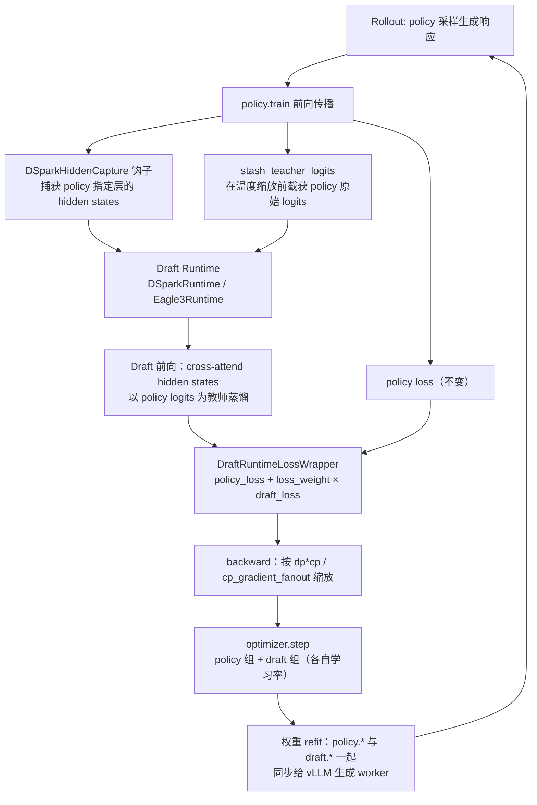
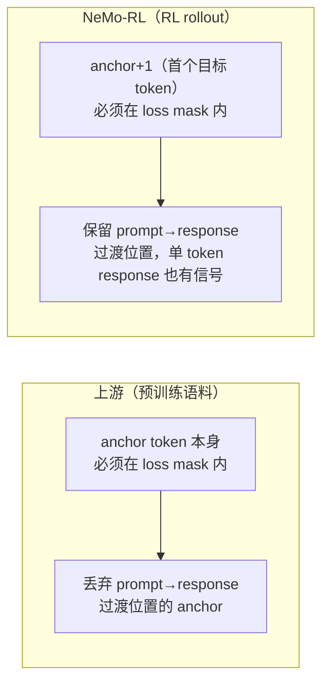
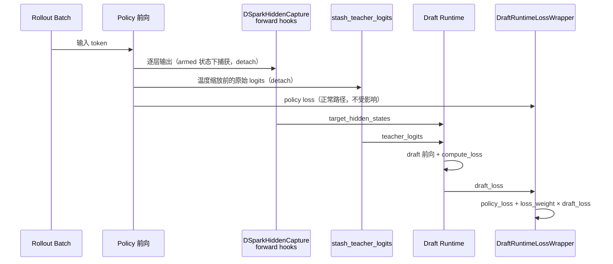
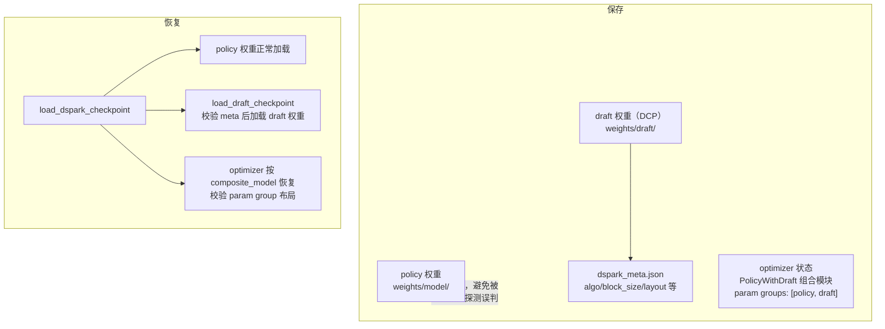
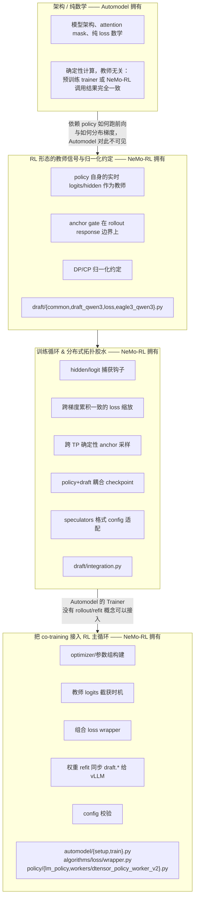

# DTensor-v2 上的 Draft 联合训练（Draft Co-Training）

本分支在 DTensor-v2（Automodel FSDP2）后端上，为三种 speculative decoding 草稿模型
（drafter）家族——**DSpark**、**DFlash**、**EAGLE3**——增加了与 policy 联合训练
（co-training）的能力。Draft 模型使用与 policy 相同的 rollout batch 进行训练，
以 policy 自身训练前向过程中产生的 hidden states / logits 作为教师信号（teacher
signal），并在权重 refit 时与 policy 权重一起同步给 vLLM 生成 worker，使下一轮
rollout 能够用最新的 draft 权重做投机采样。

本文聚焦 **co-training 这一层**：它如何复用 Automodel 的 speculative decoding
基础组件（`nemo_automodel.components.speculative.*`，Automodel r0.6.0）；对于每一处
**没有**复用的功能，说明为什么这部分职责更适合放在 NeMo-RL 这一侧。

## 0. 一图看懂：训练循环中 Draft 处于哪个位置

policy 的 loss 计算路径完全不受影响；draft 只是"顺路"读取 policy 训练前向中已经
产生的中间结果，训练出的 draft 权重再随 policy 权重一起被 refit 到推理引擎，
形成一个闭环：rollout → 训练 → refit → 下一轮 rollout 用新 draft 加速采样。

## 1. Automodel 提供了什么

Automodel r0.6.0 提供了 DSpark/DFlash/EAGLE3 预训练所需的模型定义、attention
mask 构造和 loss 数学计算（`nemo_automodel.components.speculative.dspark.*`、
`nemo_automodel.components.attention.dflash_mask`）。这些代码是纯架构 + 纯数学：
不关心训练数据从哪来、梯度如何分布，因此可以**原样字节级导入**到
`nemo_rl/models/automodel/draft/` 中：

| Automodel 符号 | 使用方式 |
| --- | --- |
| `dspark._sampling.sample_tokens` | draft 阶段的 token 采样，原样 re-export |
| `dspark.config.build_draft_config` | draft config 构建辅助函数，原样 re-export |
| `attention.dflash_mask.{create_dflash_block_mask, create_dflash_sdpa_mask}` | `draft_qwen3.py` 直接调用的 block-causal attention mask |
| `dspark.common.{AcceptRatePredictor, context_doc_ids, create_noise_embed, create_position_ids, extract_context_feature, pin_rope_inv_freq_fp32, validate_target_layer_ids}` | 未改动的辅助函数，从 `nemo_rl/models/automodel/draft/common.py` re-export |
| `dspark.markov_head.{GatedMarkovHead, RNNHead}` | markov head 类，未改动 |

`nemo_rl/models/automodel/draft/__init__.py` 把这一层定位为"thin extension
layer"：上表内容全部直接导入，只有下面几个文件包含本地代码，且每个文件顶部都
写明了它在 extend 什么、为什么（详见各文件 header 注释中对上游来源的完整引用）。

```mermaid
flowchart LR
    subgraph AM["Automodel r0.6.0（原样复用）"]
        direction TB
        AM1["dspark._sampling"]
        AM2["dspark.config"]
        AM3["attention.dflash_mask"]
        AM4["dspark.common（大部分）"]
        AM5["dspark.markov_head（基类）"]
    end
    subgraph RL["nemo_rl/models/automodel/draft/（本地扩展）"]
        direction TB
        RL1["common.py<br/>anchor 采样 gate 在 RL response 边界"]
        RL2["draft_qwen3.py<br/>教师信号=policy 实时 logits"]
        RL3["loss.py<br/>DP/CP 归一化约定"]
        RL4["markov_head.py<br/>speculators 缩减词表适配"]
        RL5["eagle3_qwen3.py<br/>从 speculators 独立 vendor"]
        RL6["integration.py<br/>RL 训练循环胶水层"]
    end
    AM --> RL
```

## 2. NeMo-RL 在哪些地方做了扩展，以及为什么

### 2.1 `common.py` —— anchor 采样要 gate 在 RL 的 response 边界上

上游 `build_anchor_candidate_mask` 要求 **anchor token 自身**落在 loss mask
内。但在 RL rollout 里，response 的第一个 token 恰好锚定在**最后一个 prompt
token** 上，这个位置按构造就不在 loss mask 里——如果照搬上游的 gate 逻辑，会
直接丢掉 prompt→response 这一转折点（恰恰是推理时开始做投机解码的地方），并让
只有一个 token 的短 response 完全拿不到 draft 训练信号。NeMo-RL 版本的
`build_anchor_candidate_mask` 改为 gate 在**第一个目标 token**（`anchor + 1`）
的 mask 上。

`sample_anchor_positions` 算法本身和上游一致，但仍然保留了完整的本地副本：
因为上游函数内部直接调用**上游自己的** `build_anchor_candidate_mask`，如果
直接 import 上游的 `sample_anchor_positions`，会悄悄地把这里刚修好的 RL anchor
gating 又丢回去。

`build_eval_mask` 把上游针对单一 layout 的 per-slot label 偏移逻辑做了泛化，
并新增 `supervised_from_slot` 处理，使同一个函数能同时服务 dspark 的
next-token layout 和 dflash 的 bonus-anchor layout（见 §2.3）。

这段代码本质上是"贴近架构"的代码，只是恰好编码了一个 RL 特有的不变量
（loss mask 来自 rollout 的 token 边界，而不是预训练语料的文档边界）——它离
模型很近，但不可能是上游的职责，因为上游根本没有"RL loss mask"这个概念。

### 2.2 `draft_qwen3.py` —— 用 teacher logits 代替 drafter 自己的 lm_head

上游 DSpark 的 `forward()` 计算蒸馏目标 `aligned_target_logits` 的方式，是把
`target_last_hidden_states` 重新过一遍**它自己的** `lm_head`。在预训练场景下
这没问题：教师是一个冻结的、独立产出的 verifier 模型。但在 RL 联合训练里，
draft 自己的 `lm_head` 恰恰是被训练的两个部分之一（`train_embed_and_head`），
如果教师信号来自自身，就等于让 draft 去拟合一个由自己不断变化产生的目标——
蒸馏目标退化了。

NeMo-RL 的 fork 版本额外接受一个可选的 `teacher_logits: [B, S, V]` 张量，
一旦提供，就从这个张量（已 detach）中 gather 出 `aligned_target_logits`，
而不再重新计算。这个张量正是 **policy 自身训练前向产生的原始 logits**
（见 §3.1）。这是唯一一处"运行 drafter"与"提供一个良定义的教师"两件事
交织得足够紧密、需要把整个 `forward()` 保留在本地而不是外面套一层 wrapper
的地方。

### 2.3 `loss.py` —— DP 归一化约定不同，而非上游的 world-size 缩放

上游 `compute_dspark_loss` 对分母做了一次 all-reduce 归一化后，又额外乘以
`dist.get_world_size()`——这对一个自己拥有 optimizer step、只需要对整个
world 缩放一次的 trainer 来说是正确的。但 NeMo-RL 的
`automodel_forward_backward` 在 backward 之前，已经把每个 microbatch 的
loss 按 `dp_size * cp_size` 缩放过（用来抵消 FSDP2 梯度平均的效果），如果这里
再套用上游的 `world_size` 乘法，就会在 `dp * cp` 个 rank 上重复修正——因此
fork 版本的 `compute_dspark_loss` 改为在一个**显式传入的 DP process group**
上做 all-reduce，返回的 loss 已经按 nemo-rl 的约定归一化好，去掉了上游的
world-size 乘法。这纯粹是分布式训练集成层面的问题：数学本身完全一样，
区别只在于最终归一化这一步由哪个系统负责——而这个归属只有在做缩放的那个
trainer 内部才能判断清楚。

`loss.py` 里的 chunked KL/TV 计算还在本分支内部收到过一次修复
（commit `e5715b63`）：把 eagle3 TTT 的 KL 计算沿序列维度分块，用来控制
长（18k token）RL rollout 序列上的 fp32 激活内存——这是固定短 block 的
预训练语料不会触发的量级。

### 2.4 `markov_head.py` —— 为 speculators checkpoint 拆分 embedding/output 词表

上游的 markov head 假设"上一个 token 的 embedding"和"输出 logits"共享同一个
词表。而本分支要支持的 speculators 格式 checkpoint（例如
`RedHatAI/*-speculator.*`）使用了一个**缩减过的 draft 词表**作为输出投影，
但输入侧的"上一个 token id"仍然是 target 词表空间的 id（draft 从始至终只在
输入端看到 target-space token id）。NeMo-RL 的 `VanillaMarkov` 子类为此增加了
独立的 `embed_vocab_size`；这是一个 checkpoint 格式兼容性的 shim，并非 RL
特有的决策，但因为它是加载本集成所面向的具体 checkpoint 所必需的，也就只能
放在这里。

### 2.5 `eagle3_qwen3.py` —— 从零 vendor，而非 Automodel 的扩展

和 DSpark 家族不同，Automodel r0.6.0 在 DTensor-v2 路径上**并没有**提供
EAGLE3 drafter（此前 EAGLE3 联合训练只存在于 Megatron 后端）。
`eagle3_qwen3.py` 是直接从 `vllm-project/speculators@0b08a89`（而非
Automodel）vendor 过来的，精简成一个自包含文件，包含以下改动，每一处都是
为 RL 而非"监督式 drafter 预训练"而做的：

- **教师 logits 来自调用方传入的张量**，而不是冻结 verifier 的 norm/lm_head
  副本——理由同 §2.2：教师必须是**当前** policy 的原始 logits（经 d2t 映射到
  draft 词表顺序），蒸馏目标才能跟得上 RL 训练过程中 policy 分布的漂移。
- **用 dense SDPA mask 代替 flex-attention block mask**——RL 训练序列足够短，
  不值得为此引入 flex-attention 依赖；mask 语义（causal + 同文档 +
  per-TTT-step 对角扩展）保持一致。
- **embedding 梯度不再被 `no_grad` 挡住**——上游 trainer 在 TTT embedding
  查表外面套的 `no_grad`，会悄悄让 `train_embed_and_head=True` 失效；这里
  改为完全由 `set_embedding_head_trainable()` 控制可训练性。
- **返回每个 step 的 loss 分子/分母**（而不是一个本地归一化好的标量），
  这样 RL runtime 就能套用自己的全局（DP-reduced、按 microbatch slot 归一化）
  组合方式——和 §2.3 里"谁负责最终归一化"是同一类拆分。

## 3. `integration.py` —— Automodel 没有位置安放的 RL 专属胶水层

`integration.py` 中的内容（checkpoint config 适配除外）之所以存在，是因为
RL 联合训练有一些监督式 drafter trainer 根本不会遇到的需求。以下内容都不是
"照原样上游化"就能解决的问题——它们**就是** RL 与 policy 的集成本身。

### 3.1 从 policy 自己的前向过程中截获教师信号

`DSparkHiddenCapture` 在 policy 的 decoder 层（以及可选的 embedding 层）上
挂 forward hook，用来捕获 draft cross-attend 所需的目标 hidden states——
捕获发生在 **policy 自己的训练前向过程中**，而不是单独跑一次教师前向。
`stash_teacher_logits` 同理，在 NeMo-RL 的温度缩放对 logits 做原地修改**之前**
把 policy 的原始 logits 截获下来。两者都会 detach，因此 draft loss 永远不会
反传进 policy 主干。

一个普通的预训练 trainer 不会遇到这个问题：它只需要加载一次冻结的教师
checkpoint，想跑就跑。但这里的"教师"**就是**正在被 RL 训练的那个模型，
每一步都要重新取值，所以 hidden/logit 的捕获必须接入 NeMo-RL 已经在跑的、
用于计算 policy loss 的那一次前向——没有别的地方可以单独跑这次捕获，而
Automodel 的 Trainer 也完全没有"复用别人前向里的 hidden state"这种 hook
接口。

这些 hook 在设计上是按 microbatch"上膛（armed）"、在 backward 阶段的
activation-checkpointing 重放时"卸膛（disarmed）"的——这个细节完全是为了
配合 NeMo-RL 自己的、带 checkpoint 的 FSDP2 训练循环，通用 drafter trainer
不需要考虑这个问题。

### 3.2 跨梯度累积与 CP 的梯度缩放记账

`begin_global_batch` 以及 `/ self._num_microbatch_slots` 的除法之所以存在，
是因为 NeMo-RL 在梯度累积（gradient accumulation）的多个 microbatch 上对
loss 做求和，而 policy loss 是按**整个 global batch** 的 token 数做归一化的
均值。要让 draft loss 跟上同样的有效缩放比例——避免 `mbs`/`gbs` 的变化悄悄
改变 draft 梯度相对 policy 梯度的比例——纯粹是 NeMo-RL 梯度累积与 CP fanout
约定带来的产物（`nemo_rl/algorithms/loss/wrapper.py` 中
`DraftRuntimeLossWrapper.draft_loss_scale = cp_gradient_fanout`）；
Automodel 通用训练循环里根本没有这样的约定需要对齐。

### 3.3 跨 TP 副本的确定性 anchor 采样

`anchor_sampling_seed` 是 `(dp_rank, global_batch_index, microbatch_index)`
的纯函数，保证同一个 DP 切片下的每个 TP/CP peer 都采样出相同的 anchor——
draft 只在 `dp_cp` 维度上做 FSDP2 切分，在 TP 维度上是被复制的，一旦 anchor
采样在各副本间出现分歧，就会悄悄让副本状态发散，并使 refit 导出的 draft
权重变成"和 rank 相关"（此问题在 commit `db050ec9` 中被 review 发现并修复）。
这是一个和 NeMo-RL 如何切分 draft 相关的分布式并行正确性问题，通用的、单一
拓扑结构的 Automodel trainer 根本不会遇到。

### 3.4 checkpoint 配对、resume 与元数据校验

`PolicyWithDraft`、`optimizer_layout_record`、`draft_meta_record`、
`save_draft_checkpoint` / `load_draft_checkpoint` / `load_dspark_checkpoint`
以及 `draft_checkpoint_dir` 实现了：

- 一个组合 `nn.Module`，让一个 optimizer（拥有按固定顺序命名的
  `["policy", "draft"]` 参数组）可以作为一个整体通过 Automodel 的
  checkpointer 保存——该 checkpointer 的约定是"一个 model 对应一个
  optimizer"；
- 一个作为 policy 权重目录**兄弟节点**的 DCP 目录（而不是嵌套在 policy
  权重目录下面），原因是 policy checkpoint 加载器通过递归遍历权重目录来
  自动判断格式，如果把 draft 的 `.distcp` 文件嵌套进去，会被误判；
- 一份带版本号的元数据记录，并在 resume 时做硬性校验（算法类型、架构字段、
  optimizer 参数组布局），防止一次运行悄悄地用 DFlash 配置去 resume DSpark
  权重（或反过来）。

这类"某个具体 trainer 如何用一个 optimizer 为两个耦合模块做 checkpoint"的
配管工作，是标准问题，但完全依赖于 NeMo-RL 自己的 `CheckpointManager` 和
Automodel 的 DCP checkpointer API，无论模型代码多么忠实于上游，这部分逻辑
都只能放在集成层。

### 3.5 speculators 格式 checkpoint 的 config 适配

`load_draft_hf_config` / `_adapt_speculators_dspark_config` /
`_adapt_speculators_eagle3_config` 把 speculators 格式的 checkpoint
（例如为 vLLM serving 生产/使用的 `RedHatAI/*-speculator.*`）翻译成 vendor
模型所期望的扁平 config 结构——重新映射嵌套的 `transformer_layer_config`，
并在 vLLM 的"id j = 第 j-1 层的输出"捕获约定和 trainer 的"输出自第 i 层"约定
之间转换 `aux_hidden_state_layer_ids`。这样做纯粹是为了让 NeMo-RL 能够
**联合训练与 vLLM 已经在 serving 的同一种 checkpoint 格式**，从而打通
"训练 → refit → serving"这个闭环；一个从零开始的 drafter trainer 完全没有
理由需要理解一个 serving 引擎的 checkpoint 方言。

## 4. RL 训练循环中的接线（`draft/` 目录之外）

上述内容被 NeMo-RL 中真正让 co-training 成为"一个 RL 特性"（而不只是
"一个模型特性"）的部分所调用：

- **`nemo_rl/models/automodel/setup.py`**：在 optimizer 构建**之前**先构建
  draft 模型（这样它的参数才能从一开始就加入 optimizer），把它作为第二个
  命名 optimizer 参数组加入（通常配一个远高于 policy 的学习率），并让 policy
  与 draft 一起 resume。
- **`nemo_rl/models/automodel/train.py`**：在训练前向中恰好还未做温度缩放的
  那个时间点（`forward_with_post_processing_fn`）把 policy 的原始 logits
  截获为 draft 的教师信号，并在训练前向外围套上 `draft_capture_ctx`。
- **`nemo_rl/algorithms/loss/wrapper.py`** 的 `DraftRuntimeLossWrapper`
  与 policy loss wrapper 并列存在：policy loss 的计算方式和没有 draft 时
  完全一样，draft loss 按 `cp_gradient_fanout` 和 `loss_weight` 缩放后加在
  上面——这和 NeMo-RL 组合其他 RL loss（例如蒸馏）的方式一致，而不是
  Automodel 组织训练 loss 的方式。
- **`nemo_rl/models/policy/workers/dtensor_policy_worker_v2.py`**：负责每个
  worker 上 draft 模型的整个生命周期——构建 `DSparkRuntime` 或
  `Eagle3Runtime`、把 hidden capture 挂到 policy 模型上，并扩展
  `prepare_refit_info` / `_refit_params_generator`，加入 `draft.<name>`
  这些 key，使**权重 refit 路径把 draft 权重和 policy 权重一起同步给 vLLM
  生成 worker**——这正是让 co-training 真正对 RL 有用的一步（下一轮 rollout
  会用更新后的 draft 权重做投机采样）。Automodel 的 Trainer 完全没有
  "refit"这个概念；这纯粹是 RL rollout 生成侧的集成点。
- **`nemo_rl/models/policy/lm_policy.py`**：校验 `policy.draft.*` 配置——
  后端限制（DSpark/DFlash 要求 DTensor-v2；EAGLE3 还可以走 Megatron 上
  已有的独立路径）、与 sequence packing 的不兼容（暂不支持）、以及在
  `policy.generation.refit_transport` 为 `nccl_reshard` 时报硬错误（它基于
  后缀的批量 key 路由机制不认识 `draft.*` 这些 key，会把它们错误地分发——
  对应 vLLM 侧的收窄修复见 commit `fcb8c266`）。

## 5. 一图总结：复用边界

| 复用边界 | 归属 | 原因 |
| --- | --- | --- |
| 模型架构、attention mask、纯 loss 数学 | Automodel（`nemo_automodel.components.speculative.*`） | 确定性、教师无关的计算；无论调用方是预训练 trainer 还是 NeMo-RL，结果完全一致 |
| RL 形态的教师信号（policy 自身实时 logits/hidden）、anchor gate 在 rollout response 边界上、DP/CP 归一化约定 | NeMo-RL（`draft/{common,draft_qwen3,loss,eagle3_qwen3}.py`） | 依赖 NeMo-RL **如何**跑 policy 前向、**如何**分布梯度——Automodel 对这两者都不可见 |
| hidden/logit 捕获钩子、跨梯度累积一致的 loss 缩放、跨 TP 确定性 anchor 采样、policy+draft 耦合 checkpoint、speculators 格式 config 适配 | NeMo-RL（`draft/integration.py`） | RL 训练循环与分布式拓扑相关的问题，上游没有对应场景 |
| optimizer/参数组搭建、教师 logits 截获时机、组合 loss wrapper、权重 refit 同步、config 校验 | NeMo-RL（`automodel/{setup,train}.py`、`algorithms/loss/wrapper.py`、`policy/{lm_policy,workers/dtensor_policy_worker_v2}.py`） | 让 co-training 真正成为 RL 主循环（rollout → 训练 → refit）的一部分；Automodel 的 Trainer 没有 rollout/refit 概念可以接入 |
