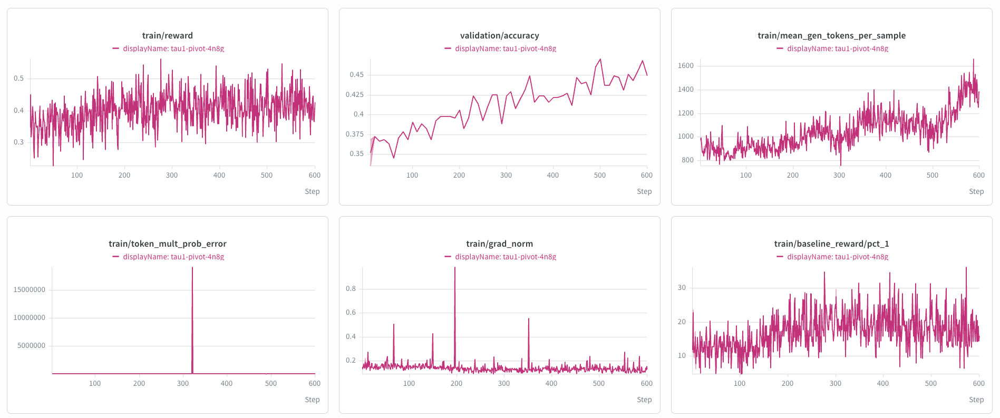

# Conversational Tool-Use Pivot RL for Qwen3-30B-A3B-Thinking

This guide explains how to reproduce the conversational tool-use scenario from **PivotRL**
([paper](https://arxiv.org/abs/2603.21383)) on
[Qwen3-30B-A3B-Thinking-2507](https://huggingface.co/Qwen/Qwen3-30B-A3B-Thinking-2507) using NeMo-Gym.

Unlike the [Two-Stage SWE RL guide](swe-rl-qwen3.md), this recipe currently only covers **stage 1
(pivot RL)** training.

## The recipe

| | |
|---|---|
| **Model** | Qwen3-30B-A3B-Thinking-2507 |
| **Environment** | NeMo-Gym `single_step_tool_use_with_argument_comparison` (tool name + fuzzy argument comparison) |
| **Data (open source)** | [`nvidia/Nemotron-RL-Agentic-Conversational-Tool-Use-Pivot-v1`](https://huggingface.co/datasets/nvidia/Nemotron-RL-Agentic-Conversational-Tool-Use-Pivot-v1) |
| **Algorithm** | Colocated synchronous GRPO on Megatron, 64 prompts x 16 generations, leave-one-out baseline, decoupled clip 0.2/0.2, no KL penalty, lr 1e-6, 32k context |

The recipe follows the original PivotRL training configuration as closely as possible. It differs
from [SWE1](swe-rl-qwen3.md) in that it uses the model's default chat template rather than a custom
interleaved-thinking template.

## Prepare the data

```bash
uv run examples/nemo_gym/prepare_conversational_tool_use_pivot_data.py \
    --output-dir datasets/conversational_tool_use_pivot --val-size 512
```

This downloads the HF dataset, sanity-checks the pivot row contract (`agent_ref`, `expected_action`,
`responses_create_params`), optionally filters by profiled difficulty
(`qwen_235b_info.reward_mean`), and writes `train.jsonl` / `val.jsonl`.

## Launch training

```bash
uv run examples/nemo_gym/run_grpo_nemo_gym.py \
    --config examples/nemo_gym/grpo_qwen3_30ba3b_thinking_stage1.yaml
```

The recipe targets 4 nodes (`cluster.num_nodes: 4`, DP=2). The original PivotRL run used 16 nodes
(DP=8); at DP=2 the per-rank optimizer state is 4x larger, so if training or the colocated vLLM
`wake_up` OOMs, enable `policy.megatron_cfg.optimizer.optimizer_cpu_offload` (see the comments at
the top of the recipe YAML for the full set of knobs).

## Training curves



Training reward and validation accuracy climb steadily to step ~500-600, with generation length
growing alongside reward (no degenerate length collapse).

## Evaluation

We evaluate with the official [tau2-bench](https://github.com/sierra-research/tau2-bench) harness
(airline / retail / telecom), using a locally served Qwen3-30B-A3B-Instruct-2507 as the user
simulator.

| | Airline | Retail | Telecom | Avg |
|---|---|---|---|---|
| Base | 53.50 | 48.46 | 24.56 | 42.17 |
| RL, step 360 | 61.50 | 50.22 | 34.21 | **48.64** |

The RL policy improves the average tau2-bench reward from **42.17 to 48.64**, with the largest gains
on airline and telecom.
